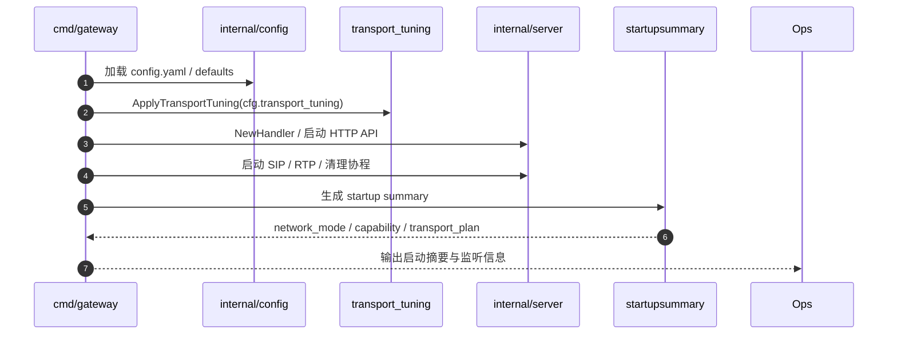
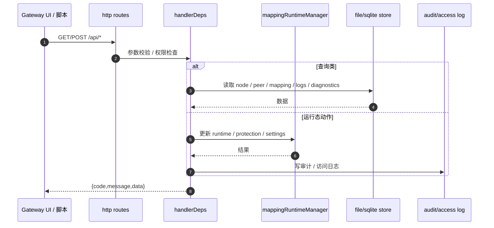
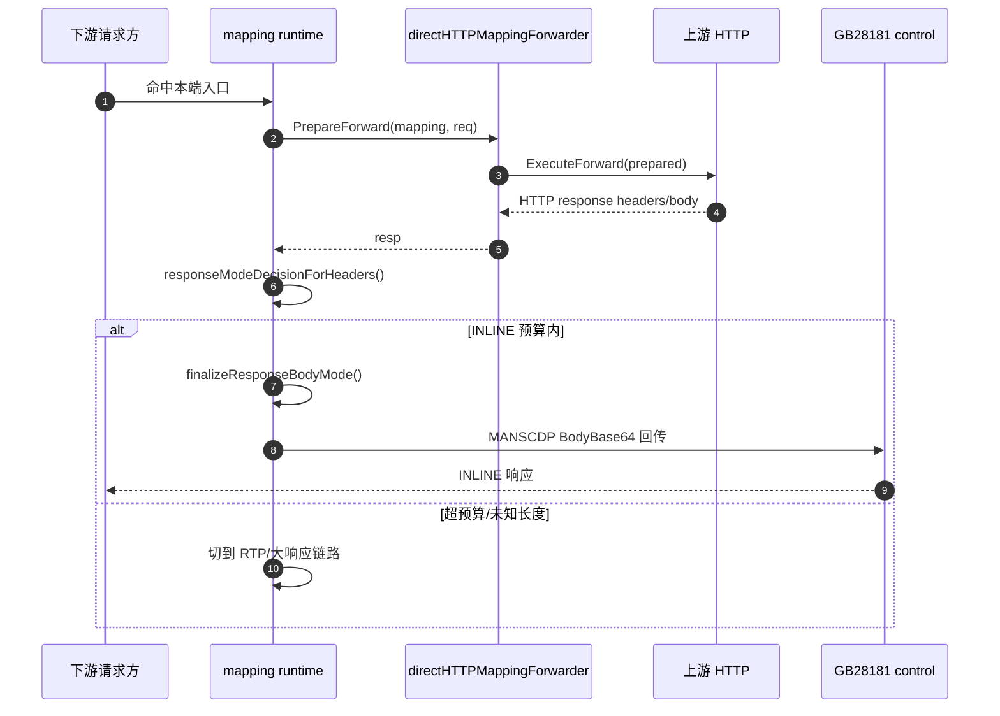
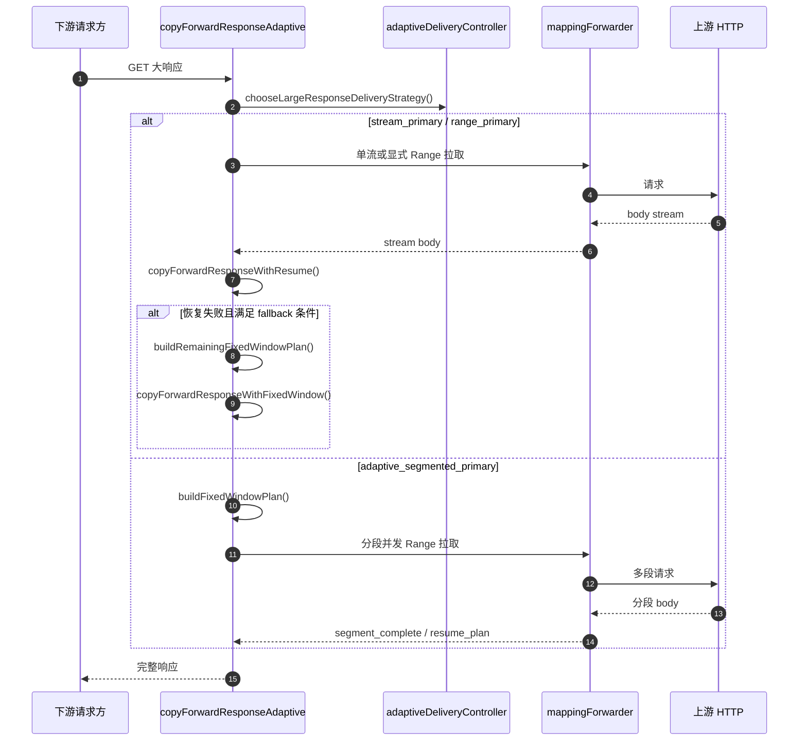
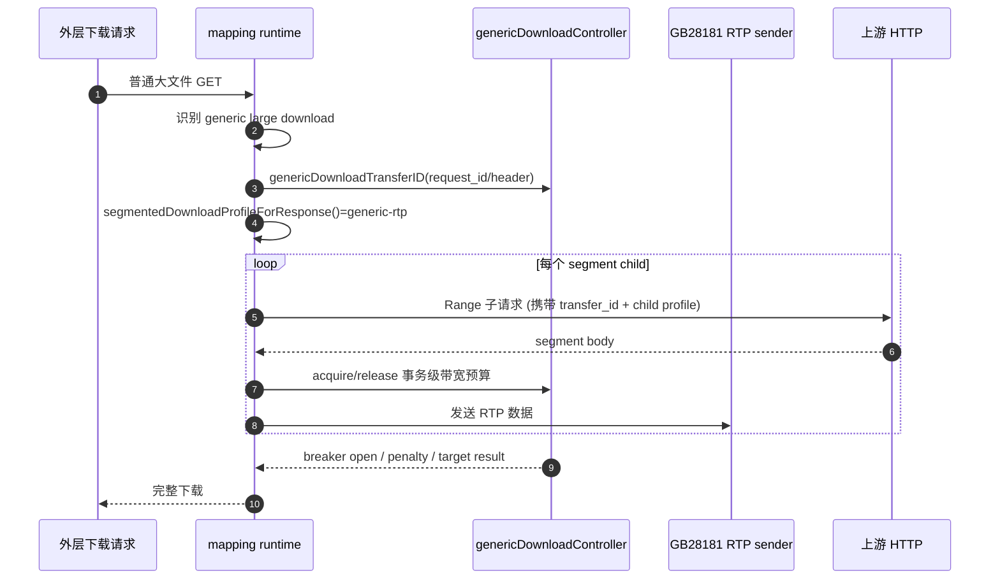
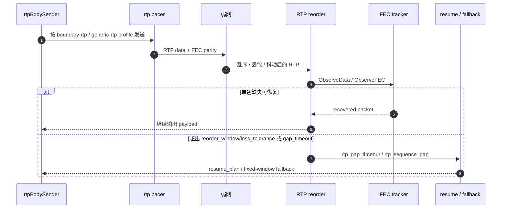
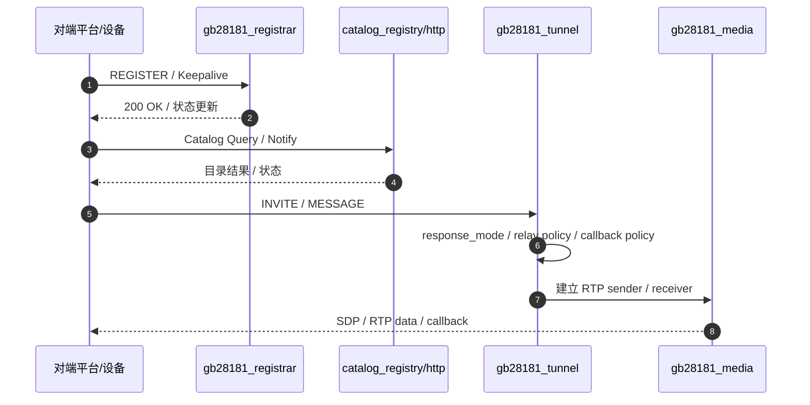
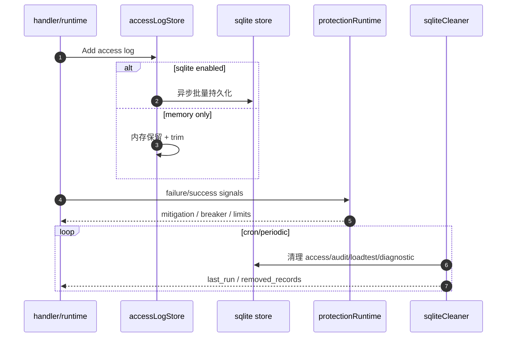

# 后台链路时序图与可优化路径复检测（2026-03-21）

本文只描述**当前源码真实执行链路**，用于反查策略是否落地、日志是否可追、后续还能在哪里继续优化。

## 1. 总览：当前后台主链路

- **启动与配置**：加载配置 → 应用 transport tuning → 启动 HTTP / SIP / RTP / 清理任务
- **管理面 API**：UI / 运维脚本访问 `/api/*` → handler → store / runtime / audit / sqlite
- **HTTP 映射主链路**：本端入口 → `PrepareForward` → 上游响应 → `response_mode` / `delivery_strategy` 决策 → INLINE / RTP / 分段
- **大响应恢复链路**：单流优先 → resume → 必要时 fixed-window fallback
- **RTP 弱网链路**：发送 profile → pacing / FEC → 接收端 reorder / gap tolerance / 恢复
- **GB28181 信令链路**：REGISTER / Catalog / INVITE / 回调 / RTP 回传
- **观测闭环**：structured log / access log / audit / diagnostics / cleaner

## 2. 启动与配置应用链路

### 当前已收口 / 仍可继续优化
- 已把 startup summary 的**关键策略族**前置成 `active_strategy_snapshot`，启动时可直接看到 response mode policy、delivery family、segmented selector、RTP send/tolerance、generic breaker。
- 仍可继续补一份与启动摘要同源的“活跃策略快照 JSON 导出”，便于部署验收和自动化比对。

## 3. 管理面 API 链路

### 可继续优化
- 把**只读查询**与**运行态写动作**在 handler 层进一步分目录，降低 `http.go` 的职责厚度。
- 给 `/api/diagnostics/export` 输出增加“链路摘要页”，直接列出当前策略快照、异常热点与关键计数。

## 4. HTTP 映射：小响应 / INLINE 主链路

### 可继续优化
- 目前 INLINE 预算模型已经集中，但**日志上的预算字段**可以再归并成一组统一前缀，减少现场 grep 成本。
- 可把 `responseModeDecision` 输出再抽成独立 helper，让 INVITE / 回调链路共享同一日志模板。

## 5. HTTP 映射：大响应主链路（策略选择 + 恢复）

### 可继续优化
- `copyForwardResponseAdaptive` 现在已经比以前干净，但“策略选择 + 观测回写 + generic breaker 回写”仍在同一函数里，后续可以再抽成 `runLargeResponseStrategy(...)`。
- fixed-window 的**顺序模式**与**并发模式**可以继续共用一套 segment telemetry builder，减少日志字段拼装重复。

## 6. Generic Download：公平分享 + 熔断 + 分段子请求

### 可继续优化
- 事务级公平分享已经成立，但**target breaker** 与**transfer breaker** 仍可继续拆成更清晰的两层观测口径。
- 可以新增一个“下载事务摘要日志”，把 active_transfers、effective_bitrate、resume_count、gap_count 收成单条 summary。

## 7. 播放 / RTP 弱网链路（重排 + FEC）

### 可继续优化
- 现在 FEC 是**单丢包 XOR parity**，后续若现场继续偏差大，可评估升级到更强的块级纠删编码，但要严控复杂度和 CPU。
- reorder / fec / gap 目前都各自有日志，下一步可以补一个统一的 `rtp_ps_summary` 聚合摘要，减少现场拼图成本。

## 8. GB28181 信令链路（REGISTER / Catalog / INVITE / 回调）

### 可继续优化
- REGISTER / Catalog / INVITE 当前都能闭环，但**每条链路的关键摘要字段**仍散在多类日志里；建议补一份 device/call 级 summary。
- 回调地址推导已经集中到 `advertisedSIPCallbackForRemote`，后续可继续把“本地 / 对端 / NAT 感知”诊断字段做成统一 helper。

## 9. 观测 / 清理 / 保护链路

### 可继续优化
- access log 已有 Summary，但“失败热点 + source/mapping 拓扑”可以进一步做成固定摘要，直接服务运维首页。
- protection 与 mapping runtime 的边界已比以前清晰，后续可继续把错误分类字典集中化，减少同义 reason 漂移。

## 10. 本轮复检测结论

### 当前已经比较干净的点
- 大响应交付策略已经收口到四类运行态。
- segmented profile 已经有统一选择入口。
- RTP tolerance policy / send profile / FEC 已经成体系。
- 历史 `AUTO` 运行态事实已经退出主线。

### 仍值得继续优化的点
1. **大响应执行器再收一层**
   - 把策略选择、执行、观测回写拆成更薄的 orchestrator + executor。
2. **RTP 摘要日志统一**
   - 让 reorder / gap / fec / resume 有一条 summary，而不是一线人工拼接。
3. **管理面 handler 再按职责拆分**
   - 查询类、写动作类、诊断导出类可进一步拆目录。
4. **启动摘要补“活跃策略快照”**
   - 让部署验收直接看到当前生效的 delivery / RTP / inline policy。
5. **保护与错误分类继续标准化**
   - 减少 failure reason 的近义词漂移，提升告警聚合质量。

## 11. 本轮源码清洁动作

- 删除后端根目录 scratch 文件 `gateway-server/tmp_calc.go`
- 删除仓库根目录临时输出 `build-gateway-error.txt`
- 删除仓库根目录历史验收日志 `strict-acceptance-full.log`
- 移除多处只剩定义、不再走真实链路的 helper
- 新增 `.gitignore` 与仓库级 `README.md`

## Round-continued：继续清洁后的结构事实

- `internal/server/http.go`：保留共享类型、依赖装配、基础工具与未拆分 handler；不再继续承载任务/节点/状态类大段业务处理。
- `internal/server/http_ops_tasks_routes.go`：任务、限流、兼容 routes 等运维类入口。
- `internal/server/http_nodes.go`：节点、节点配置、兼容性快照。
- `internal/server/http_status.go`：自检、网络状态、启动摘要、系统状态、诊断导出。
- `internal/netdiag/error_text.go`：共享网络失败词典，供运行时分类、上游错误治理、loadtest 结果分类共用。

### 本轮可直接观察到的收益

1. 反查“一个 API 入口到底属于哪个链路”时，不再先穿越 3000+ 行 `http.go`。
2. 生产日志、运行时降级、loadtest 分类开始共享同一套超时/拒绝/中断词典，减少近义词漂移。
3. 后续再做 handler 继续拆分时，可以按职责簇递进推进，而不是再次回到单文件堆叠。
